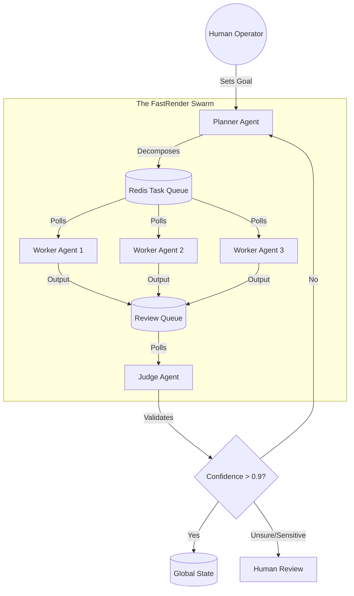
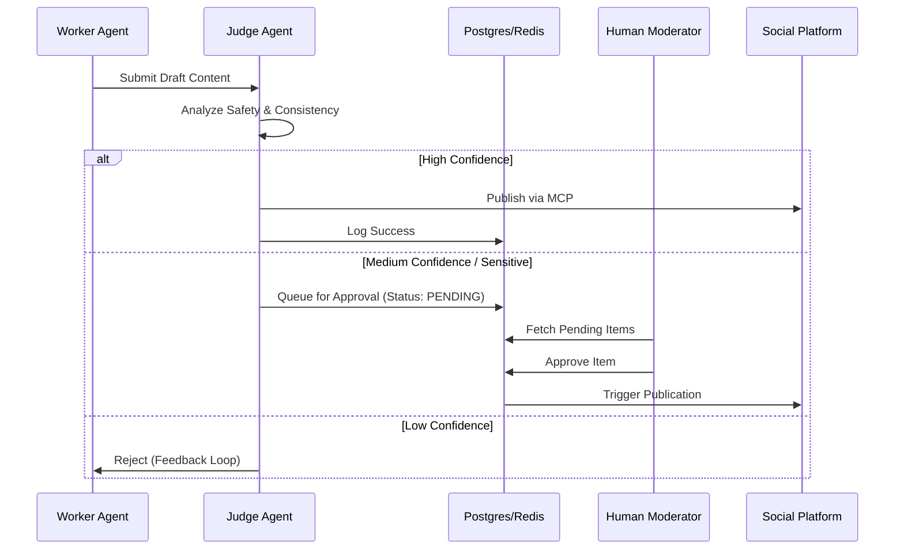

# Domain Architecture Strategy

## 1. Executive Summary
This document defines the architectural strategy for Project Chimera, translating the high-level requirements from the SRS into concrete structural decisions. The focus is on scalability, safety, and data integrity for a swarm of autonomous influencer agents.

## 2. Agent Pattern: Hierarchical Swarm (FastRender Pattern)

### Decision
We select the **Hierarchical Swarm** pattern (specifically the "FastRender" implementation detailed in the SRS) over a Sequential Chain (e.g., LangChain chains).

### Rationale
*   **Parallelism vs. Latency:** Sequential chains are blocking; if step 2 fails, the whole chain stops. A swarm allows multiple "Workers" to execute tasks in parallel (e.g., generating 50 replies simultaneously).
*   **Specialization:** By decoupling "Planning" (Strategy) from "Working" (Execution) and "Judging" (Review), we prevent context pollution. A Worker doesn't need to know the entire campaign history, only the specific task at hand.
*   **Resilience:** If one Worker fails, the Planner simply re-queues the task. The system is self-healing.

### Architecture Diagram

## 3. Human-in-the-Loop (HITL): The Safety Layer

### Location of Approval
The Human-in-the-Loop safety layer is strictly enforced at the **Post-Generation / Pre-Publication** stage, managed by the **Judge Agent**.

### Implementation Strategy
The "Judge" is the architectural bottleneck designed to prevent unsafe content from leaking to the public internet. It functions as a specialized firewall.

1.  **Confidence-Based Routing:**
    *   **High Confidence (>0.9):** Automated pass.
    *   **Medium Confidence (0.7-0.9):** Routed to **Orchestrator Dashboard** for async human approval.
    *   **Low Confidence (<0.7):** Auto-reject and retry.
2.  **Mandatory Filters:** Any content triggering "Sensitive Topic" classifiers (politics, finance) bypasses the confidence score and goes straight to HITL.

### Governance Workflow

## 4. Database Strategy: SQL (PostgreSQL) for Metadata

### Decision
We select **SQL (PostgreSQL)** as the primary store for high-velocity video metadata and operational logs, supplemented by **Redis** for the immediate ingestion queue.

### Rationale
*   **Relational Integrity:** Video metadata (file paths, duration, prompts, timestamps) is not isolated; it is deeply relational. It must link to a specific `AgentID`, a `CampaignID`, and a `LedgerTransactionID` (cost tracking). SQL ensures these relationships are enforced (Referential Integrity).
*   **JSONB Flexibility:** Modern PostgreSQL supports `JSONB`, allowing us to store flexible/unstructured metadata (e.g., varying API responses from generative video tools) while identifying it with structured columns.
*   **Transactional Accuracy:** The SRS emphasizes "Agentic Commerce" and "Budget Governance". We cannot risk "eventual consistency" (common in some NoSQL) when tracking the financial cost of video generation. We need ACID compliance to ensure that if a video is generated, the cost is deducted from the budget atomically.
*   **Operational Logs:** The "high-velocity" aspect is handled by the **Redis** layer for the `TaskQueue` and `Episodic Memory`. Once the task is complete (video generated), the final robust record is written to PostgreSQL.

### Data Topology

| Data Type | Storage Engine | Purpose |
| :--- | :--- | :--- |
| **Transactional/Metadata** | **PostgreSQL** | User accounts, Campaign config, Video Metadata (Asset Library), Financial Audit Logs. |
| **Hot Queue/State** | **Redis** | Task queues, Short-term conversation history, Rate limits. |
| **Semantic Knowledge** | **Weaviate** | Long-term memory, Persona definitions that need semantic search. |
| **Video Assets** | **S3 / Blob Storage** | The actual video files (referenced by URL in Postgres). |
