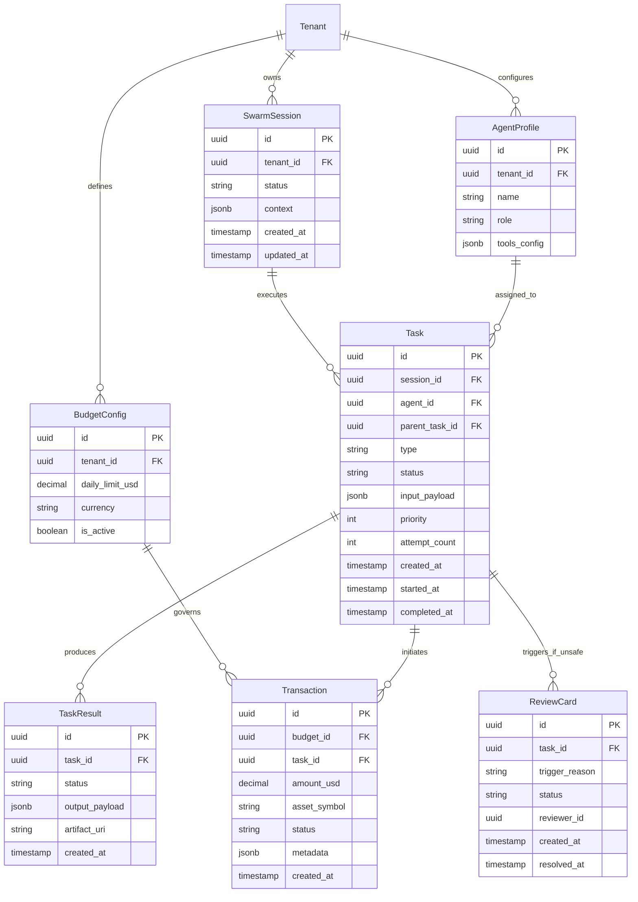

# Data Architecture & Management Specification

## 1. Overview & Database Strategy

Project Chimera employs a **Polyglot Persistence** strategy to handle the distinct requirements of high-velocity agent coordination, transactional integrity, and semantic memory.

### Technology Stack
*   **Primary Relational Store (PostgreSQL 16+)**: Source of truth for all business-critical entities, relational data, and audit logs.
*   **High-Velocity State Store (Redis 7+)**: Handles ephemeral state, distributed locking, task queues, and real-time agent heartbeats.
*   **Vector Database (Weaviate)**: Semantic memory store for agent experiences, allowing retrieval-augmented generation (RAG) and long-term learning.

## 2. Unified Schema Architecture

### 2.1. Relational Schema (PostgreSQL)

The relational schema is divided into three core domains: **Swarm Orchestration**, **Commerce Governance**, and **Safety & Stability**.

### 2.2. Ephemeral State Schema (Redis)

Redis is used for high-velocity write operations that would bottleneck PostgreSQL.

| Key Pattern | Type | TTL | Description |
|:---|:---|:---|:---|
| `chimera:queue:{priority}` | List | N/A | Task distribution queues (High/Normal/Low). |
| `chimera:agent:{agent_id}:heartbeat` | String | 30s | Agent liveness signal & current load. |
| `chimera:lock:resource:{id}` | String | Var | Distributed locks for critical sections. |
| `chimera:spend:{tenant_id}:{date}` | String | 24h | Real-time daily spend accumulator (atomic INCR). |
| `chimera:session:{session_id}:stream` | Stream | 1h | Real-time event log for UI observability. |

### 2.3. Semantic Schema (Weaviate)

Used for agent long-term memory and context retrieval.

**Class: `AgentMemory`**
*   `content` (text): The raw text of the observation, result, or interaction.
*   `embedding` (vector): 1536d vector (e.g., via OpenAI text-embedding-3).
*   **Properties**:
    *   `tenant_id` (string): Multi-tenancy isolation.
    *   `session_id` (string): Context scoping.
    *   `agent_role` (string): Source of the memory.
    *   `importance_score` (number): Relevance weight.
    *   `created_at` (date): Temporal ordering.

## 3. Data Lifecycle Management

### 3.1. Ingestion & Transformation
*   **Ingestion**:
    *   **API**: REST/gRPC via Swarm Management API for direct control.
    *   **Events**: OpenClaw Protocol messages (Task Assignment) via Message Broker / Webhooks.
*   **Validation**: Pydantic models validate structure at the edge.
*   **Transformation**: Raw inputs are normalized into `Task` records.
*   **Persist-First**: Tasks are persisted to Postgres `PENDING` state *before* being pushed to Redis queues to ensure durability.

### 3.2. Migration Strategy (Schema Evolution)
*   **PostgreSQL**: Managed via **Alembic**.
    *   All migrations must be reversible (Up/Down).
    *   CI/CD pipeline blocks PRs if model definitions differ from migration scripts.
*   **Weaviate**: Managed via custom schema migration scripts in `scripts/db/weaviate_migrator.py`.
    *   Checks for class existence and property consistency on startup.

### 3.3. High-Velocity Metadata Handling
*   **Telemetry**: Agent heartbeats and raw logs bypass the DB and go directly to the observability pipeline (or Redis Streams for hot viewing).
*   **Batching**: High-frequency updates (e.g., partial task progress) are aggregated in Redis and flushed to Postgres in micro-batches (e.g., every 5s or on completion) to reduce write IOPS.
*   **Partioning**: `Transaction` and `Task` tables are partitioned by `created_at` (monthly) to maintain query performance as history grows.

## 4. Data Flow & Consistency

### The "Task-Driven" Flow
1.  **Creation**: User/System creates a Task -> **Postgres** (Status: `QUEUED`).
2.  **Dispatch**: Scheduler pushes Task ID to **Redis** Queue.
3.  **Execution**: Agent pops Task ID -> updates Redis Heartbeat.
4.  **Memory Check**: Agent queries **Weaviate** for similar past tasks (`AgentMemory`).
5.  **Completion**:
    *   Agent writes `TaskResult` to **Postgres**.
    *   Agent creates embedding of result -> **Weaviate** (New Memory).
    *   Redis queue task is ACKed.
6.  **Safety**: If `ReviewCard` is triggered, Task state moves to `BLOCKED` in **Postgres**, alerting the Review Service.

## 5. Backup & Recovery
*   **Postgres**: Daily full snapshots, WAL archiving for Point-In-Time Recovery (PITR).
*   **Redis**: RDB snapshots every 15 minutes (ephemeral data loss acceptable).
*   **Weaviate**: Periodic filesystem backups (re-indexing is possible from Postgres source of truth if catastrophic failure occurs).
